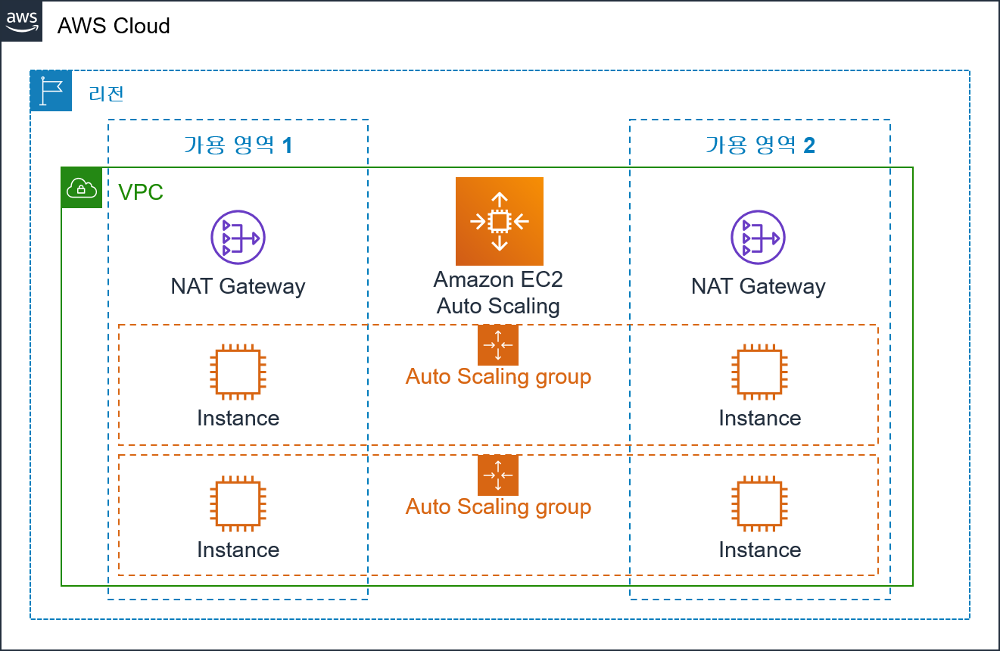

이 카테고리에서는 AWS를 공부를 한 내용들, 실습한 내용들을 위주로 작성하며 기록해 나갈 예정입니다.

 

# AWS?

AWS는 아마존 웹 서비스(Amazon Web Services)의 약자로 클라우드 서비스를 제공하는 플렛폼입니다. 클라우드 서비스를 통해 인터넷만 된다면 사용자로 하여금 원하는 만큼의 IT 자원을 사용할 수 있습니다.

 

# 클라우드의 종류

클라우드는 서비스 제공 형태에 따라 아래와 같이 구분됩니다.

## IaaS (Infrastructure as a Service)

인터넷을 통해 최종 사용자에게 `IT 인프라를 제공`하는 형태의 클라우드 컴퓨팅입니다. IaaS는 주로 서버리스 컴퓨팅과 관련이 있습니다.

## PaaS (Platform as a Service)

하드웨어/소프트웨어 플랫폼이 제3자를 통해 제공되는 클라우드 컴퓨팅의 한 형식입니다. `애플리케이션만을 사용자가 관리`하는 형태로, 플랫폼을 구축하고 유지관리할 필요 없이 자체 애플리케이션을 개발, 실행 및 관리 할 수 있도록 해줍니다.

## SaaS (Software as a Service)

애플리케이션과 기본 IT 인프라 및 플랫폼을 사용자에게 제공하는 클라우드 컴퓨팅 형태입니다. `서비스 제공자가 애플리케이션까지 관리`하는 형태 입니다.

## Serverless - BaaS (Backend as a Service)

애플리케이션 개발과 운영에 `미리 필요한 다양한 기능들`(데이터베이스, SNS서비스 연동 등)을 API 형태로 `제공`합니다. 이로인해 서버개발을 최소화 하면서 필요한 기능 개발에 집중할 수 있습니다.

 

# 인프라 규모에 따른 구분

인프라의 규모에 따라 데이터센터, 가용영역, 리전으로 구분된다.

> 데이터센터 < 가용영역 < 리전

## 데이터센터

컴퓨팅 서비스를 제공하기 위한 물리적으로 공간.

## 가용영역

한개 이상의 데이터 센터의 모임. 서로 분산되어 있어 재난이나 장애 상황에 대비에 용이. 이를 위해 두개 이상의 가용영역으로 구성하는 것이 좋음.

## 리전

가용영역의 모임. 최소 2개 ~ 최대 6개의 가용 영역으로 구성.

 
