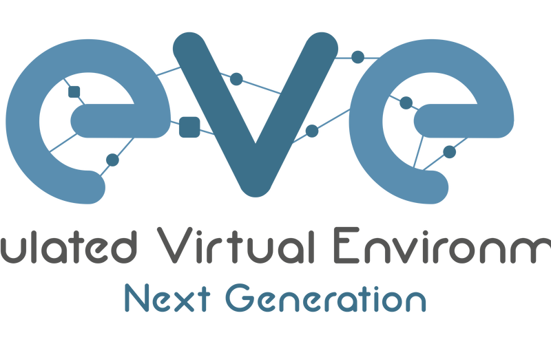

# 1. eve-ng?

eve-ng는 스위치를 가상화하여 LAB을 할 수 있는 시뮬레이터이다. 잘 알려진 시뮬레이터로 eve-ng, GNS3, Dynamips, VIRL가 있다.

# 2. 준비물

- 가상머신 (VMware, VirtualBox)
- FTP / SCP Client(WinSCP, FileZilla)
- 제품 가상 이미지

> eve-ng: v2.0.3-110 기준 작성

# 3. 다운로드

## eve-ng OVF 다운로드

`EVE-NG OVF`를 클릭하여 다운로드 후 압축 해제

## eve-ng Windows Client Side 다운로드

`Windows integration pack`을 클릭하여 다운로드

## VMware 다운로드

[Download](https://my.vmware.com/en/web/vmware/downloads/info/slug/desktop_end_user_computing/vmware_workstation_player/16_0)로 이동하여 `VMware workstation` 다운로드 및 설치

VirtualBox 등 다른 가상머신을 사용해도 되지만, 본 예시에서는 VMware를 사용한다.

## WinSCP 다운로드

[Download](https://winscp.net/eng/docs/guide_install)로 이동하여 `WinSCP` 다운로드 및 설치

스위치 이미지 등의 파일을 eve-ng로 전송하기 위해 FTP/SCP를 사용한다.
FileZilla 등 다른 FTP 클라이언트를 사용해도 되지만, 본 예시에서는 WinSCP를 사용한다.

# 4. 구성 절차

## VMware

1. File -> Open -> 다운받은 `EVE-COMM-VM.ovf` 선택

2. 가상 머신 경로와 파일명 지정

3. 가상머신 설정 변경

> `Virtualize Inter-x/EPT or AMD-V/RVI` 체크

> `NAT` 체크

4. 가상머신 실행 및 로그인

> `ID/PW(root/eve)` 입력

5. 기타 설정 적용

6. 정상 로그인 확인

> 변경한 PW 입력

> `admin/eve` 입력하여 접속

## Windows Client

> EVE-NG `Windows Client` 설치
