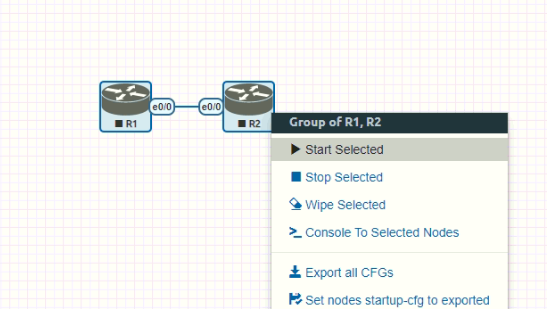

# 1. 준비물

- eve-ng에서 지원하는 스위치 이미지
  > 본 예시에서는 Cisco IOU/IOL을 사용한다.
  > eve-ng에서 지원 가능한 이미지는 [이 링크](https://www.eve-ng.net/index.php/documentation/supported-images/)에서 확인이 가능하다.
- FTP or SCP Client(WinSCP, FileZilla)
- 터미널 프로그램(Putty, Teraterm, SecureCRT 등)

## Cisco IOU/IOL?

Cisco 내부에서 테스트용으로 사용하는 스위치 이미지. 공식적으로는 외부 반출이 안되겠지만, 아이러니 하게도 구글링을 통해 구할 수 있다.

> - IOU: IOS on Unix
> - IOL: IOS on Linux

# 2. 다운로드

IOU 혹은 IOL을 다운로드 받는다.

공식적인 배포가 이뤄지지 않으므로, 구글링이 필요하다.

# 3. 구성 절차

## 스위치 이미지 업로드


> WinSCP를 통해 eve-ng 접속


> 경로 이동(/opt/unetlab/addons/iol/bin/)
>
> 파일 업로드(스위치 이미지)

## 권한 설정


> 터미널 프로그램을 통해 SSH 접속 후 경로 이동(/opt/unetlab/addons/iol/bin/)
>
> 명령어 입력(/opt/unetlab/wrappers/unl_wrapper -a fixpermissions)

## keygen.py 생성

```python
#! /usr/bin/python
import os
import socket
import hashlib
import struct

# get the host id and host name to calculate the hostkey
hostid=os.popen("hostid").read().strip()
hostname = socket.gethostname()
ioukey=int(hostid,16)

for x in hostname:
	ioukey = ioukey + ord(x)

print("hostid=" + hostid +", hostname="+ hostname + ", ioukey=" + hex(ioukey)[2: ])

# create the license using md5sum
iouPad1 = b'\x4B\x58\x21\x81\x56\x7B\x0D\xF3\x21\x43\x9B\x7E\xAC\x1D\xE6\x8A'
iouPad2 = b'\x80' + 39*b'\0'

md5input=iouPad1 + iouPad2 + struct.pack('!i', ioukey) + iouPad1
iouLicense=hashlib.md5(md5input).hexdigest()[: 16]

print("[license]\n" + hostname + " = " + iouLicense + ";\n")
```

> vi 편집기를 이용해 keygen.py 를 위와 같이 입력

## keygen.py 실행


> python3 kegen.py 명령어를 입력하여 라이선스 발급

## 라이선스 입력


> vi 편집기를 이용해 `iourc` 파일 생성 / 라이선스 입력

# 4. 동작 확인

## 로그인


> EVE-NG 웹 페이지로 로그인
>
> > ID: admin
> >
> > PW: eve

## Lab 생성


> `Add new lab` 선택


> `Name`, `Version` 등 Lab 정보 입력 후 `Save` 선택

## Node 추가


> `Add an object` 버튼 클릭 후 `Node` 선택


> Template: `Cisco IOL` 선택


> Number of nodes to add: 추가할 노드 수 입력
>
> Image: L2/L3 이미지 선택
>
> ICON: 아이콘 이미지 선택

## Node 연결


> 생성된 노드에 마우스를 올리면 `주황색 케이블` 아이콘 표시
>
> 이를 `연결할 장비로 드래그`


> 각 노드 별 연결할 `인터페이스를 선택` 후 `save` 클릭


> 연결 확인

## Node 시작



> 단일 장비 혹은 다수의 장비 드래그하여 선택 후 우클릭
>
> `Start` 클릭
